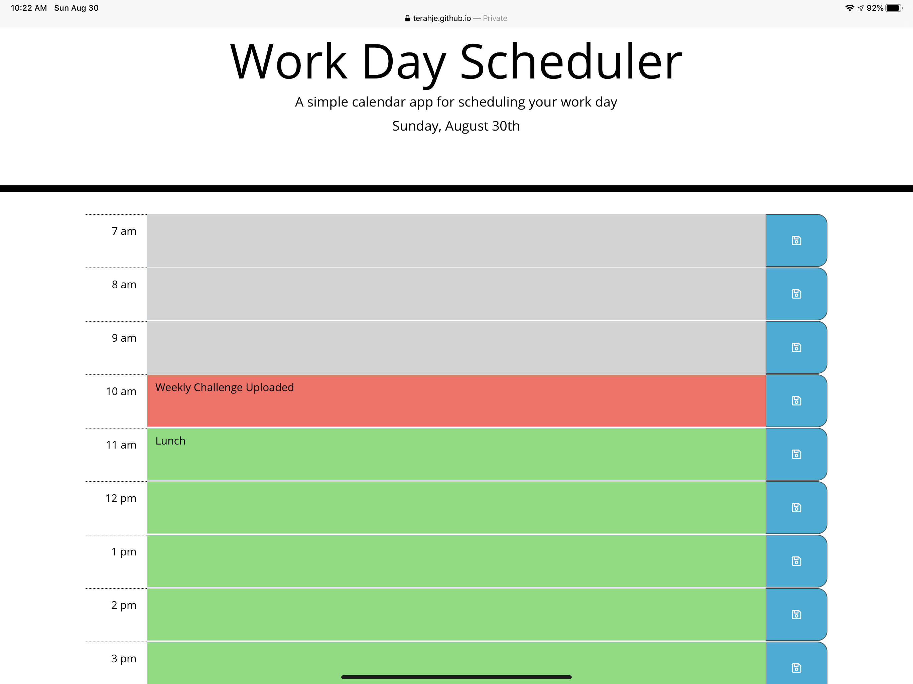

# Work Day Scheduler Starter Code

**Description:  A work day scheduler to keep you productive throughout the day.** 

This work planner displayed the skills picked up throughout this lesson.  The use of jQuery and moment.js allows this scheduler to keep up with the time of the day and shows you different colors accordingly.  The default schedule may show grey, but if there is time in the day it will show in green, and the current hour will be displayed in red.   

Technologies Used: HTML, CSS, JavaScript, jQuery, Bootstrap 

https://terahje.github.io/week-5-challenge/

